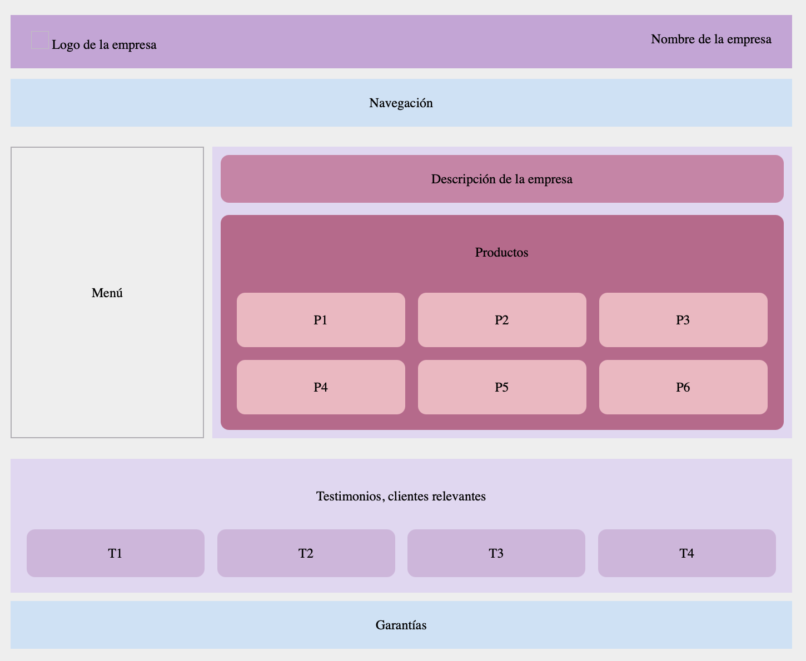

# Práctica 1: Introducción a Sass

##### Fecha de entrega:
Jueves 2 de Octubre de 2025

##### Trabajo realizado:
Se han realizado los cuatro ejercicios básicos de introducción a Sass con los que se buscaba interiorizar los conceptos básicos de éste.

Por otro lado, se ha implementado un documento **html** que se ha estilado hasta que responda a un esquema proporcionado, aplicando los principios de Flex, Grid y Sass

##### Ejemplo de ejecución:

