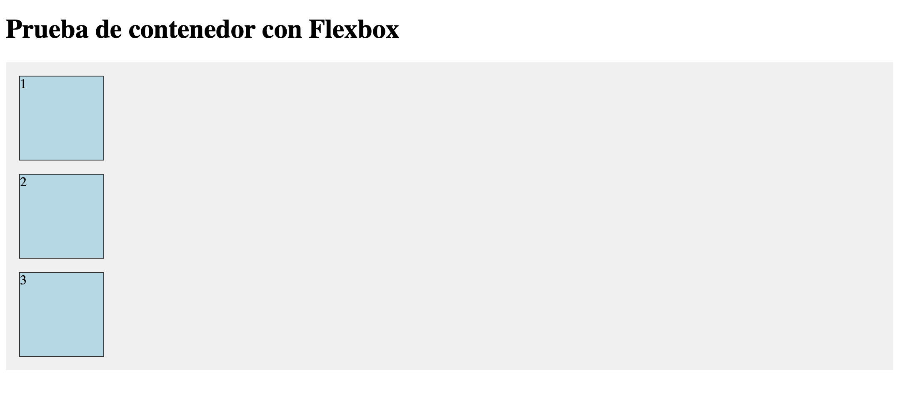

# Práctica 1: Introducción a Sass

##### Fecha de entrega:
Jueves 2 de Octubre de 2025

##### Trabajo realizado:
Se han realizado los cuatro ejercicios básicos de introducción a Sass con los que se buscaba interiorizar los conceptos básicos de éste.

El primero de los ejercicios solicitaba la creación de un parcial de definición de las variables para el color primario y secundario, y utilizarlo para definir estilos para el body y los títulos h1 h2. Luego, habría que verificar que las variables se hayan aplicado correctamente.

De esta forma, la aplicación del estilo se ve como en la imagen:

.

El segundo de los ejercicios pedía construir una hoja de estilos Sass para un sistema de mensajes de estado (como alertas de éxito, error o información) que sea modular, DRY (Don't Repeat Yourself) y fácil de mantener, creando el estilo base en un parcial que no se compile por sí sólo, usándolos para definir estilos específicos para mensajes informativos, de error y de éxito. El color del fondo debía ser acorde con lo que representan. Además los enlaces dentro del mensaje de error debían estar en negrita. 

Para comprobar que se transpila correctamente se creó un documento HTML de prueba, cuya ejecución se puede ver en la siguiente imagen:

.

El tercer ejercicio solicitó crear dos mixins, uno que permita establecer la dirección de un contenedor flexbox y el otro que permita dar un tamaño específico en un elemento. 

Para verificar que transpila y funciona correctamente, se ha creado un HTML de ejemplo que permita la visualización del contenido:

.

El último de los ejercicios pedía utilizar un bucle @for para generar 5 clases de espaciado llamadas margin-1 a .margin-5. Cada clase debe tener un margin que se incremente en 10px por cada iteración. 

Se transpiló el archivo y se revisó el CSS generado, cuyo funcionamiento coincide con el de la siguiente imagen:

.

Por otro lado, se ha implementado un documento **html** que se ha estilado hasta que responda a un esquema proporcionado, aplicando los principios de Flex, Grid y Sass.

##### Ejemplo de ejecución del esquema proporcionado:

