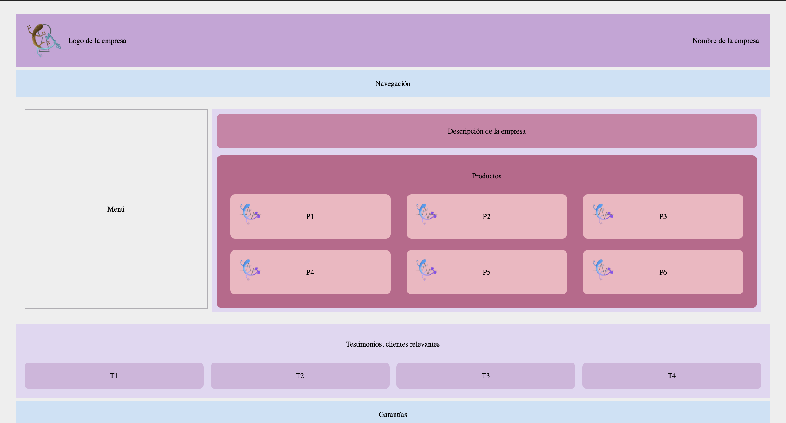

# Práctica 2: Proyecto Gulp

##### Fecha de entrega:
Jueves 23 de Octubre de 2025

##### Trabajo realizado:
Tomando el mockup realizado en la práctica 1, se les han aplicado algunas herramientas de automatización y *bundling*, con el objetivo de cumplir con los siguientes requerimientos:

- Compilar Sass a CSS
- Minificar CSS
- Generar sourcemaps para depuración
- Optimizar imágenes de la carpeta *img/*
- Minificar archivos JS si los hubiera

Para ello, se hicieron dos ejercicios utilizado las herramientas ***gulp*** y ***parcel***.

###### Ejercicio 1:

En este primer ejercicio se hizo uso de **gulp**, una herramienta muy utilizada dentro del desarrollo web, debido a la multitud de tareas que permite automatizar de una forma sencilla.

**Gulp** se utiliza para:

- Definir las tareas que se van a ejecutar en el proceso.

- Definir el orden de esas tareas y cuándo van ejecutarse.

- Paralelizar tareas.

- Ejecutar tareas condicionales, atendiendo a las condiciones y opciones que se hayan definido.

De esta manera, tras elaborar un archivo *gulpfile.js* y *package.json*, e instalar los paquetes necesarios, se ha obtenido el siguiente log:

desplegando así de forma efectiva la página diseñada.

Como se mencionó, Gulp requiere la elaboración de un archivo *gulpfile.js*. Para el realizado en esta práctica, se han tenido en cuenta:
- Las librerías que se van a requerir (cada tarea requiere una o más de una)
- La especificación de las rutas en las que se encuentra cada archivo (donde están los ficheros JavaScript, scss, imágenes con su correspondiente formato permitido, html...)
- Se debe declarar una función correspondiente a cada una de las tareas que se quiera realizar. De esta manera, al declarar `function jsTask()` se indicarán elementos como el formato de la salida que se espera.
- Por último, se le indica a **Gulp** qué tarea debe realizar y cuál es el nombre de cada una de ellas: `gulp.task('js', jsTask);` 

Mediante la ejecución del comando `gulp` desde una terminal, comenzará el proceso de *bundling* y se abrirá automáticamente una ventana del navegador donde permita la visualización de la página del proyecto.

###### Ejercicio 2:

**Parcel** surge con el propósito de simplificar las complejidades asociadas a los *bundlers* tradicionales, considerando que su configuración es mucho más rápida y sencilla que la de **gulp**.

**Parcel** tiene varias ventajas frente a otros *bundlers*, como son:

- Gestión de Activos Integrada

- Resolución Automática de Dependencias

- Tiempos de Construcción Rápidos

- División del Código Simplificada

En esta ocasión, lo único que se debió configurar fue un archivo *package.json*, donde se indicasen algunos datos del proyecto (autor, versión, nombre del proyecto, licencias...), las dependencias que se debieran utilizar, y los scripts a los que haría referencia cada uno de los comandos aplicados. 

En el json anterior ya fueron definidos los comandos que **Parcel** podría ejecutar. De esta manera, si se definió sobre qué archivos debería actuar *start*, *clean* o *build*, se podría ejecutar `npm run start`, `npm run clean` o `npm run build` para obtener cada una de las acciones requeridas. En esta ocasión, en lugar de abrir una ventana del navegador directamente como ocurría con **Gulp**, al ejecutar `npm run start` se obtendrá un log como el que se muestra a continuación, donde se indica en qué puerto está alojada nuestra página, pudiendo acudir a él desde la barra de búsqueda del navegador para acceder a la misma: 

##### Ejemplo de ejecución:

En ambos casos, la salida obtenida es:

