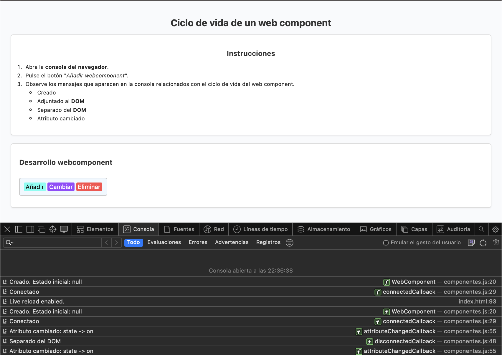
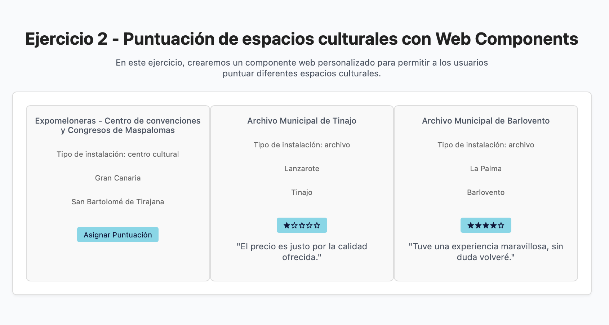

# Práctica 3: WebComponents

##### Fecha de entrega:
Jueves 23 de Octubre de 2025

##### Trabajo realizado:
Esta práctica pretende familiarizar al alumno al uso de *webComponents* que permitan la reutilización de pequeños fragmentos de código con funcionalidad propia en los proyectos, facilitando así el desarrollo ágil de sistemas personalizados.
Para este fin, se propusieron dos ejercicios: 

###### Ejercicio 1:
Este primer ejercicio buscaba ilustrar el ciclo de vida de un web component, considerando los estados de Creado, Adjuntado al DOM, Separado del DOM, cambio en los atributos. 

Para ello, se han colocado algunos botones de creación de nuevos web compononents, modificación de sus atributos, o eliminación de los mismos, tal y como se observa en la imagen:

##### Ejercicio 2:
El segundo ejercicio pretendía simular una página de espacios culturales de Canarias donde se pudiera visualizar la valoración de algunos de estos emplazamientos.

Para esto, la página carga automáticamente tres espacios de un archivo **espacios-culturales.json** y los muestra por pantalla, junto a algunos datos como *Tipo de espacio*, *Isla* en el que se encuentra y *Municipio* en el que se sitúa.

Junto a esta información aparece un botón que genera una puntuación aleatoria, que pretende simular la asignación de una valoración al espacio. Junto a esta valoración aparecerá igualmente un comentario que simule ser una reseña de alguien que haya visitado ese lugar, aunque realmente se trate de una línea de texto extraída de un fichero **valoraciones.json**

