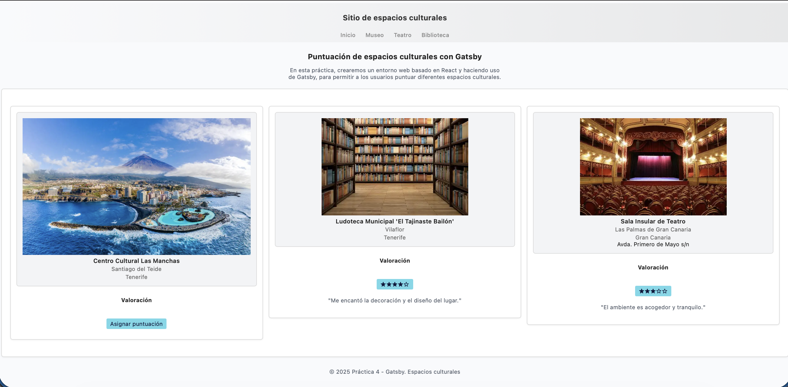

# Práctica 4: Gatsby

### Fecha de entrega:
Lunes 24 de noviembre de 2025

### Trabajo realizado

Esta práctica consiste en desarrollar un prototipo de sitio estático utilizando **Gatsby**, siguiendo los principios de la arquitectura *JAMSTACK* y empleando *React* y *GraphQL* para gestionar componentes y datos.

El objetivo principal es mostrar información sobre espacios culturales de Canarias, generando tarjetas dinámicas basadas en datos cargados desde ficheros JSON que actúan como una API simulada.

### Resumen del desarrollo

1. Configuración del proyecto
Se creó un proyecto Gatsby desde cero, configurando los plugins necesarios para:
	•	manejo de imágenes (gatsby-plugin-image)
	•	lectura y transformación de datos JSON
	•	uso de estilos CSS propios

2. Páginas iniciales y navegación
Se implementó una página de inicio (index) y tres páginas adicionales enlazadas mediante <Link>, siguiendo la estructura pedida en el guion.

3. Layout reutilizable
Se creó un componente Layout que unifica el encabezado, navegación y pie de página, usando children para integrar el contenido de cada página.

4. Componentes y datos dinámicos
Se desarrollaron los componentes:
	•	EspacioCultural
	•	Valoracion
	•	Noticias

Los datos se obtienen mediante GraphQL desde tres ficheros JSON (espacios, valoraciones y noticias).

En la página de inicio se muestran tres tarjetas aleatorias, combinando de forma dinámica espacio + valoración + noticia, simulando la lógica realizada previamente con WebComponents.

5. Generación automática de páginas
Con gatsby-node.js se genera una página por cada espacio cultural, incorporando título dinámico, imagen, valoración y noticias.

6. Imágenes y estilos
Se integraron imágenes mediante '<StaticImage />' y se reutilizó/ajustó la hoja de estilos de la práctica anterior para mejorar la presentación y unificar el diseño.

Todo esto puede observarse en la ejecución del programa, tal y como muestra la imagen siguiente:

