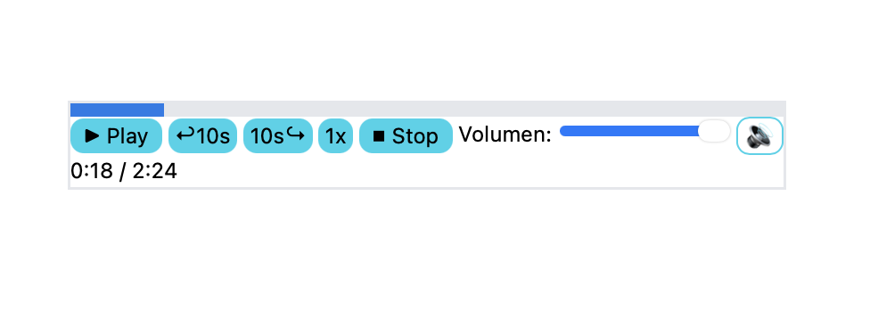

# Práctica 5: Reproductor Multimedia

### Fecha de entrega:
Martes 23 de diciembre de 2025

### Trabajo realizado

Esta práctica consiste en el desarrollo de un reproductor multimedia personalizado utilizando la *Media API* de *HTML5*, partiendo del reproductor básico visto en clase y ampliándolo con nuevas funcionalidades avanzadas mediante HTML, CSS y JavaScript.

El reproductor implementado es de audio, aunque la lógica desarrollada sería igualmente aplicable a un reproductor de vídeo. El objetivo principal es profundizar en el control programático de los elementos <audio> y en la gestión de eventos asociados a la reproducción multimedia.

### Resumen del desarrollo

1. Estructura base del reproductor
   
Se partió del reproductor básico proporcionado en clase, compuesto por:

	•	Un elemento <audio> con carga de metadatos.
	•	Controles esenciales de reproducción (play/pause y stop).
	•	Control de volumen mediante un slider.
	•	Visualización del tiempo actual y de la duración total del audio.

Esta base sirvió como punto de partida para la incorporación progresiva de las mejoras solicitadas.

2. Barra de progreso interactiva
   
Se implementó una barra de progreso personalizada que muestra visualmente el avance de la reproducción.

	•	La barra se actualiza dinámicamente usando el evento timeupdate del elemento <audio>.
	•	El usuario puede hacer clic sobre la barra para desplazarse a cualquier punto del audio, calculando la posición seleccionada y actualizando el valor de currentTime.
	•	La barra se ha estilizado mediante CSS para integrarse visualmente con el resto del reproductor.

3. Control de velocidad de reproducción
   
Se añadieron controles para modificar la velocidad de reproducción. La velocidad se ajusta dinámicamente mediante la propiedad playbackRate del elemento <audio>.

4. Saltos adelante y atrás
   
El reproductor incorpora botones para realizar saltos temporales en la reproducción:

	•	Salto de 10 segundos hacia adelante.
	•	Salto de 10 segundos hacia atrás.

Estos controles modifican directamente la propiedad currentTime, teniendo en cuenta los límites del audio para evitar valores inválidos.

5. Botón de silencio
   
Se implementó un botón de silencio (mute) que:

	•	Silencia el audio al pulsarlo.
	•	Restaura el volumen previo cuando se vuelve a pulsar.

Para ello, se almacena el valor anterior del volumen antes de activar el modo silencioso.

6. Guardado y restauración de la posición
   
Se añadió persistencia de estado mediante localStorage:

	•	La posición actual de reproducción se guarda periódicamente.
	•	Al recargar la página, el reproductor restaura automáticamente el punto exacto en el que se encontraba el audio.

Esto mejora la experiencia de usuario y demuestra el uso combinado de la Media API con el almacenamiento local del navegador.

Todo esto puede observarse en la ejecución del programa, tal y como muestra la imagen siguiente:

