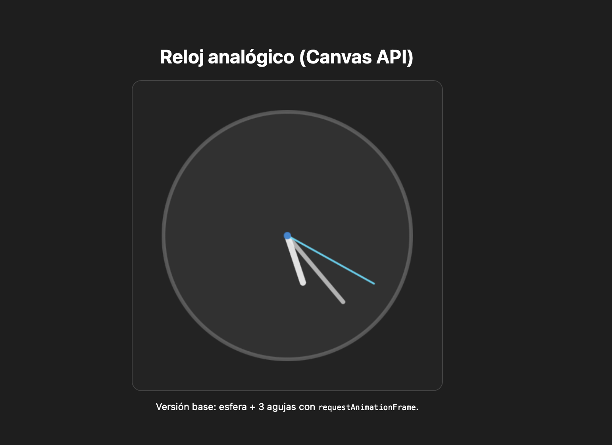

# Práctica 6: Canvas API

### Fecha de entrega:
Lunes 29 de diciembre de 2025

### Trabajo realizado

Esta práctica consiste en el desarrollo de una aplicación gráfica utilizando la **Canvas API de HTML5**, cuyo objetivo es dibujar y animar gráficos en un lienzo de forma dinámica.

Para la resolución de la práctica se ha optado por implementar un **reloj analógico**, una de las aplicaciones propuestas en el enunciado. El reloj muestra la hora actual del sistema mediante tres agujas (horaria, minutera y segundera), que se actualizan en tiempo real.

El objetivo principal del desarrollo es familiarizarse con el uso del elemento `<canvas>`, el contexto de renderizado 2D y la animación eficiente mediante `requestAnimationFrame`.

### Resumen del desarrollo

1. Estructura del proyecto
El proyecto se organiza en tres archivos principales, siguiendo una separación clásica de responsabilidades:
	•	Un archivo **HTML**, que define la estructura básica de la página y contiene el elemento `<canvas>` donde se dibuja el reloj.
	•	Un archivo **CSS**, encargado de los estilos visuales, como colores, tipografías, alineación de elementos y dimensiones del canvas.
	•	Un archivo **JavaScript**, que implementa toda la lógica de dibujo, animación y actualización del reloj.

2. Inicialización del canvas y contexto 2D
En el archivo JavaScript se obtiene el elemento `<canvas>` definido en el HTML y se accede a su contexto 2D mediante el método `getContext("2d")`. Este contexto proporciona las herramientas necesarias para dibujar líneas, arcos y formas en el lienzo.

3. Conversión de valores angulares
Para representar correctamente las agujas del reloj, se trabaja con ángulos expresados en radianes. Se implementa una función auxiliar que convierte fracciones de vuelta (por ejemplo, segundos/60) en radianes.

Además, se ajusta el ángulo inicial para que el punto de origen se sitúe en la parte superior del reloj, de forma coherente con la representación tradicional de un reloj analógico.

4. Dibujo de la esfera del reloj
Se implementa una función específica para dibujar la esfera del reloj. Esta función traza un círculo centrado en el canvas, aplicando un color de relleno y un borde visible, que sirve como base visual del reloj.

5. Dibujo de las agujas
Las tres agujas del reloj (horaria, minutera y segundera) se dibujan utilizando una única función genérica. Esta función recibe como parámetros el ángulo, la longitud y el grosor de la aguja, lo que permite reutilizarla para los distintos tipos de agujas variando únicamente estos valores.

La posición final de cada aguja se calcula mediante funciones trigonométricas (`cos` y `sin`), partiendo siempre desde el centro del canvas.

6. Renderizado dinámico del reloj
La función principal de renderizado se encarga de coordinar el dibujo completo del reloj. En cada actualización:
	•	Se limpia el canvas para evitar solapamientos.
	•	Se dibuja la esfera del reloj.
	•	Se obtiene la hora actual del sistema.
	•	Se calculan los ángulos correspondientes a horas, minutos y segundos.
	•	Se dibujan las tres agujas con sus características visuales específicas.

El cálculo de los segundos incluye los milisegundos, lo que permite un movimiento suave y continuo de la aguja segundera.

7. Animación mediante requestAnimationFrame
El reloj se mantiene actualizado mediante un bucle de animación que utiliza `requestAnimationFrame`. Este mecanismo permite sincronizar el repintado del canvas con la frecuencia de refresco del navegador, garantizando una animación fluida y eficiente en el uso de recursos.

Gracias a este enfoque, el reloj responde de forma continua a los cambios en el tiempo del sistema, constituyendo una aplicación gráfica dinámica e interactiva basada en Canvas API.

Todo lo anterior puede observarse en la ejecución del programa, tal y como se muestra en la siguiente imagen:

