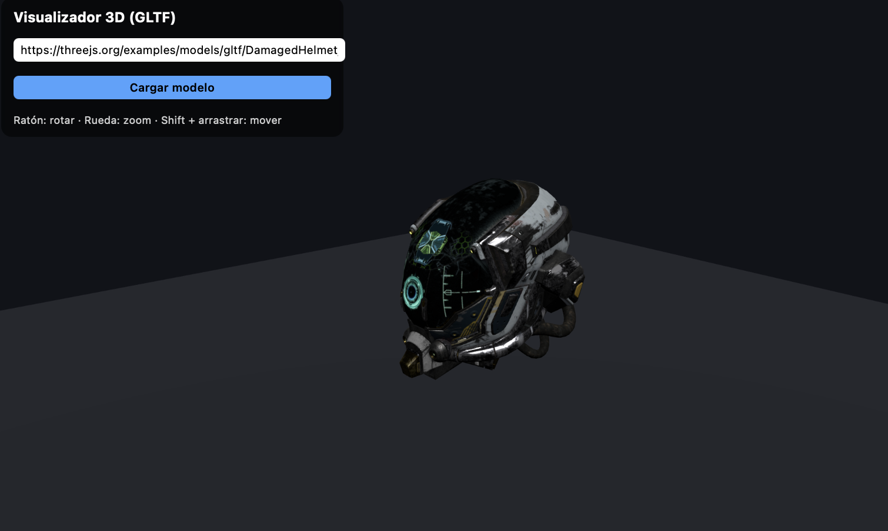

# Práctica 7: Three.js

### Fecha de entrega:
Lunes 29 de diciembre de 2025

### Trabajo realizado

Esta práctica consiste en el desarrollo de un visualizador de modelos 3D interactivo utilizando la librería *Three.js*, aplicando los conceptos vistos en clase relacionados con gráficos 3D en la web.

El objetivo principal es crear un sitio web sencillo que permita cargar modelos 3D en formato GLTF/GLB desde una URL, visualizarlos correctamente en escena y permitir la interacción del usuario mediante controles de cámara, iluminación y renderizado en tiempo real.

La aplicación se ha implementado como un sitio web estático, utilizando HTML, CSS y JavaScript, con una separación clara de responsabilidades entre los distintos ficheros.

### Resumen del desarrollo

1. Estructura base de la aplicación

Se partió de una estructura mínima compuesta por:

	•	Un fichero HTML que define el canvas de renderizado y una interfaz básica.
	•	Un fichero JavaScript que contiene la lógica de Three.js.
	•	Un fichero CSS para el estilado de la interfaz.

Esta estructura permite mantener el código organizado y fácilmente extensible.

2. Configuración de la escena 3D

En el fichero JavaScript se inicializan los elementos fundamentales de Three.js:

	•	Renderer WebGL, encargado del renderizado de la escena.
	•	Escena, como contenedor de todos los objetos 3D.
	•	Cámara de tipo PerspectiveCamera, configurada con valores adecuados de campo de visión y planos de recorte.

Además, se implementa un sistema de redimensionado automático, de forma que la escena se adapta correctamente al tamaño de la ventana del navegador.

3. Interacción del usuario mediante controles de cámara

Se incorporan OrbitControls para permitir la interacción del usuario con la escena:

	•	Rotación del modelo mediante arrastre del ratón.
	•	Zoom mediante la rueda del ratón.
	•	Desplazamiento lateral usando combinaciones de teclas.

Esto cumple con el requisito de interacción directa con el contenido 3D.

4. Iluminación de la escena

Para garantizar una correcta visualización de los modelos, se implementa un sistema de iluminación sencillo pero efectivo:

	•	Luz hemisférica, que aporta iluminación ambiental.
	•	Luz direccional, que simula una fuente de luz principal y mejora la percepción de volumen.

Este conjunto permite visualizar correctamente tanto modelos estáticos como animados.

5. Carga dinámica de modelos 3D desde URL

Uno de los puntos clave de la práctica es la carga dinámica de modelos:

	•	Se utiliza GLTFLoader para cargar modelos en formato GLTF/GLB desde una URL introducida por el usuario.
	•	El modelo cargado reemplaza al anterior, evitando duplicaciones en escena.
	•	Se encapsula el modelo en un grupo contenedor para garantizar un tratamiento correcto de modelos animados o con jerarquías complejas.

6. Centrando y escalado automático de modelos

Para asegurar que cualquier modelo sea visible correctamente:

	•	Se calcula la bounding box del modelo cargado.
	•	El modelo se centra automáticamente en los ejes X y Z.
	•	Se ajusta su posición vertical para que quede apoyado sobre el plano del suelo, evitando intersecciones geométricas.
	•	Se recoloca la cámara en función del tamaño del modelo, garantizando que se muestre completo independientemente de su escala original.

Este proceso permite que el visualizador sea robusto frente a modelos de distintos tamaños y características.

7. Elementos de referencia visual

Se añade un plano horizontal que actúa como suelo, proporcionando una referencia espacial para el usuario y mejorando la percepción tridimensional del modelo visualizado.

Todo esto puede observarse en la ejecución del programa, tal y como muestra la imagen siguiente:

